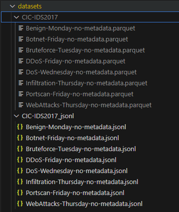

# agent-for-harmful-information-detection

基于UltraRAG的网络威胁检测agent，集成 **DeepSeek-v2-lite** 和 **minicpm-2b embedding 模型**。提供数据获取、预处理、爬取和 JSONL 转换流水线，便于安全实验和模型训练。

---

## 系统概览

- **任务**：网络威胁流量  
- **输入**：流量特征
- **输出**：威胁类型（如 DoS、DDoS、Botnet 等） 
- **特点**：
  - 基于 **UltraRAG** 开发的 Agent  
  - 使用 **DeepSeek-v2-lite** 进行检索  与生成
  - Embedding 模型：**minicpm-2b**  
  - JSONL 数据集统一管理，支持本地和在线数据源  

---

## 目录结构
github上截图然后放进去吧

---

## 环境安装

- **Python** 3.10+  
- 推荐使用虚拟环境：
```bash
python -m venv .venv
source .venv/bin/activate  # Windows: .venv\Scripts\activate
pip install -r requirements.txt
````

---

## 配置数据集

在 `configs/datasets.yaml` 配置数据集，例如：

```yaml
HateSpeech-Davidson:
  urls:
    - https://raw.githubusercontent.com/t-davidson/hate-speech-and-offensive-language/master/data/labeled_data.csv
  type: csv

SpamAssassin-Public:
  urls:
    - https://spamassassin.apache.org/old/publiccorpus/20030228_easy_ham.tar.bz2
    - https://spamassassin.apache.org/old/publiccorpus/20030228_spam.tar.bz2
  type: tar

# 支持本地文件
# demo:
#   urls:
#     - file:///ABSOLUTE/PATH/TO/demo.csv
#   type: csv
```

注意：Kaggle 或部分官网页面仅提供说明页，请替换为直链或使用本地 `file://`。

---

## 使用方法

### 1) 下载与转换为 JSONL

```bash
python datasets_downloader.py --config configs/datasets.yaml --workers 4
# 仅处理指定数据集
python datasets_downloader.py --config configs/datasets.yaml --dataset HateSpeech-Davidson
```

输出路径：`datasets/<dataset_name>/<dataset_name>.jsonl`

示例 JSONL（文本类）：

```json
{"id":"1","text":"example","label":0}
```


### 3) 文本清洗

```bash
python preprocess.py --input weibo_data.jsonl --output weibo_data.clean.jsonl --text-field text
```

---

## 数据集示例（CIC-IDS2017）

* **Infiltration (渗透攻击)**：攻击者试图进入网络内部并窃取信息
* **Portscan (端口扫描)**：攻击者扫描网络端口寻找潜在漏洞
* **WebAttacks (Web 攻击)**：SQL 注入、XSS 等 Web 攻击
* **DDoS (分布式拒绝服务)**：大流量攻击使目标服务过载
* **DoS (拒绝服务)**：单源流量攻击
* **Benign (良性流量)**：正常网络行为
* **Botnet (僵尸网络)**：被恶意软件控制的计算机流量
* **Bruteforce (暴力破解)**：反复尝试用户名/密码

标签分布：

```
label
DoS             584991
Benign          458831
Bruteforce      389714
DDoS            221264
Infiltration    207630
Botnet          176038
WebAttacks      155820
Portscan        119522
```

---

## 测试

```bash
pytest -q
```

---

## 故障排查

* 返回 0 条：可能结构变更或反爬策略，尝试 selenium、代理与更大延迟
* Selenium 失败：检查 `--chrome-binary` 或本地 Chrome，确保 undetected-chromedriver 可用
* 无法直链：先手动下载，用 `file://` 引入
* 编码异常：使用清洗器或先转码

---

## 合规与隐私

* 仅抓取公开可见内容，遵循 robots.txt 和平台协议
* 不采集敏感个人信息，仅保存匿名/哈希化 ID
* 控制访问频率，避免对站点造成负担

---

## 环境与硬件

* **GPU**：NVIDIA 4090
* **系统**：Ubuntu / Python 3.10+
* **模型**：
  * DeepSeek-v2-lite
  * minicpm-2b embedding
* **Agent**：基于 UltraRAG


*清洗过的数据*