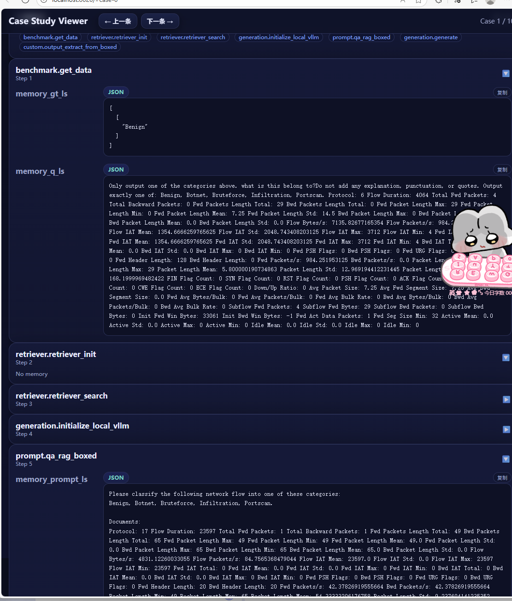
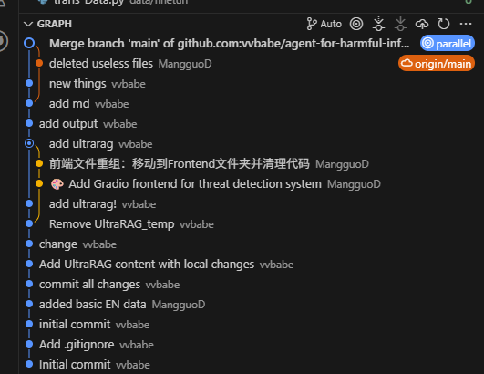

# agent-for-harmful-information-detection

基于UltraRAG的网络威胁检测agent，集成 **DeepSeek-v2-lite** 和 **minicpm-2b embedding 模型**。提供数据获取、预处理、爬取和 JSONL 转换流水线，便于安全实验和模型训练。

---
github地址：https://github.com/vvbabe/agent-for-harmful-information-detection/tree/main/UltraRAG/output
## 系统概览

- **任务**：网络威胁流量  
- **输入**：流量特征
- **输出**：威胁类型（如 DoS、DDoS、Botnet 等） 
- **特点**：
  - 基于 **UltraRAG** 开发的 Agent  
  - 使用 **DeepSeek-v2-lite** 进行检索  与生成
  - Embedding 模型：**minicpm-2b**  
  - JSONL 数据集统一管理，支持本地和在线数据源  

---
## 环境与硬件

* **GPU**：NVIDIA 4090
* **系统**：Ubuntu / Python 3.10+
* **模型**：
  * DeepSeek-v2-lite
  * minicpm-2b embedding
* **框架**：基于 UltraRAG
* **数据库**：FAISS数据库
模型与数据集过大，不上传至github

## 环境安装

- **Python** 3.10+  
- 推荐使用虚拟环境：
```bash
python -m venv .venv
source .venv/bin/activate  # Windows: .venv\Scripts\activate
pip install -r requirements.txt
````

---

## 数据集示例（CIC-IDS2017）

* **Infiltration (渗透攻击)**：攻击者试图进入网络内部并窃取信息
* **Portscan (端口扫描)**：攻击者扫描网络端口寻找潜在漏洞
* **WebAttacks (Web 攻击)**：SQL 注入、XSS 等 Web 攻击
* **DDoS (分布式拒绝服务)**：大流量攻击使目标服务过载
* **DoS (拒绝服务)**：单源流量攻击
* **Benign (良性流量)**：正常网络行为
* **Botnet (僵尸网络)**：被恶意软件控制的计算机流量
* **Bruteforce (暴力破解)**：反复尝试用户名/密码

标签分布：

```
label
DoS             584991
Benign          458831
Bruteforce      389714
DDoS            221264
Infiltration    207630
Botnet          176038
WebAttacks      155820
Portscan        119522
```

---

## 测试

```bash
pytest -q
```

---


清洗过的数据


现已实现知识库索引编码

  embedding_path: embedding/embedding.npy
  faiss_use_gpu: true
  index_chunk_size: 50000
  index_path: index/index.index

结果存储：
评价结果：UltraRAG/output
输出结果：UltraRAG/output.txt
prompt：UltraRAG/qa_rag_boxed.jinja

使用可视化脚本快速浏览模型输出
python ./script/case_study.py \
  --data output/memory_nq_vanilla_rag_20250921_052256.json \
  --host 0.0.0.0 \
  --port 8020 \
  --title "Case Study Viewer"


运行
ultrarag run vanilla_rag.yaml

提交历史



